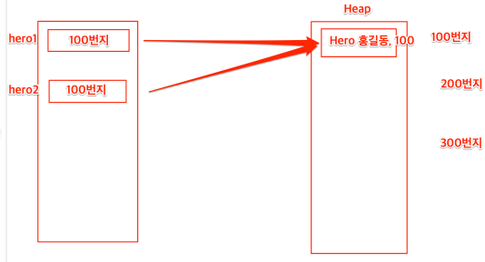

# 2024-12-19

## 📚 오늘 배운 내용
- 초기화
  - companion object : 자바의 static과 동일 -> 공유자원
- 생성자
  - 기본 생성자
  - 보조 생성자
    - 보조 생성자는 기본 생성자를 반드시 상속 받아야한다
    - constructor 키워드 사용해서 오버로딩
    - 주의할 점 : 주 생성자와 부 생성자 인자가 같으면 충돌난다
- toString() 
  - Data Class 에서는 자동으로 만들어준다
  - 따로 설정해주지 않고 호출하면 주소값이 나온다
- coerceIn() : 범위지정 함수
- 실행중 메모리 할당
  - heap 동적할당
  - stack 지역변수
  
    ```kotlin
    val here1 = Hero(name = "홍길동", hp = 100)
    val here2 = hero1
    hero2.hp = 200      //-> 인스턴스 : 1개   
    ```

## 💻 예제 코드
<!-- 실습한 코드나 예제를 추가 -->
- 단축키
```text
ctrl + alt + 화살표        // 클래스간 탭 이동 가능
```
- powershell
```shell
winget install 설치할거
```


## 🔍 참고 자료

## ❓ 궁금한 점

- 

---

### 회고

- 헷갈리고 배고프다
- 초기화 위치별 변수에 접근하는 방식 다른 점 주의하기


### Follow up

- TDD 시도
- lateinit / lazy
- require() : 예외처리 함수. 매개변수의 값이 참인지 체크하고, 거짓이면 throw illegalArgumentException
- reflection : 실행 시점(동적으로) 객체의 Property와 Method에 접근할 수 있는 방법을 의미한다
- kotlin DSL : 도메인 특화 언어(Domain-Specific Languages)의 약자. 특정 영역(Domain)에서만 사용하며, 그 영역에서 원하는 목적을 달성하는데에 집중해서 만들어진 언어
