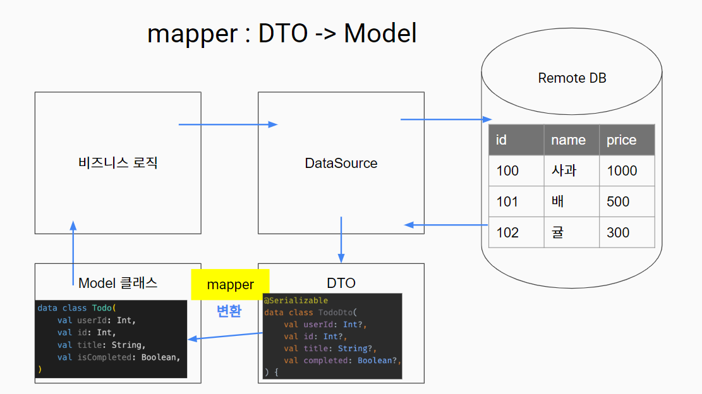

# 2025-01-09

## 📚 오늘 배운 내용
- DTO (Data Transfer Object)   
데이터 소스를 모델 클래스로 변환하는 과정에서 순수하게 클래스에 담기 위한 중간 전달 객체   
  (이제 DataSource는 모델 말고 Dto 객체를 반환한다)

  - DTO가 필요한 경우
    - Model Class 는 non-nullable 한 값만 가지고 있도록 한다
    - Json 데이터는 null 값을 포함할 수 있다 (문서에 명시되어 있지 않더라도)
    - Map -> Model Class 변환시 null 값 등의 예외를 사전에 걸러내기 용이하다
    - 불완전한 코드가 포함될 것 같을 때 사용한다
    - Json 값에 예외가 없다면 반드시 DTO를 도입할 필요는 없다
- 역할 분담
    - DTO : 데이터 소스 직렬화, 역직렬화
    - Model Class : DTO에서 필요한 내용만 활용하는 도메인 객체

- Mapper   
DTO 필요한 부분을 모델 클래스로 변환하는 유틸 메소드이다   
Nullable을 non-Nullable로 변환하는 것이 핵심

- 데이터 흐름   
Json - DTO - Mapper 활용하여 모델 클래스로 변환 - Model Class
  - DataSource는 DTO를 반환
  - Repository는 DTO를 Model로 변환하여 반환


## 💻 예제 코드
<!-- 실습한 코드나 예제를 추가 -->
- it
```kotlin
.map { PharmacyMapper.mapToDomain(it) } 
// it : 람다식에서 암시적 매개변수.  store 리스트의 각 항목(Pharmacy 객체)

.map { pharmacy -> PharmacyMapper.mapToDomain(pharmacy) }
// it을 명시적으로 지정하면 위와 같이 쓸 수 있다
```


## 🔍 참고 자료

## ❓ 궁금한 점

- null 처리    
isNotEmpty() vs ?: ""   
isNullEmpty / blank

- MaskStoreRepositoryImplTest에서 충돌   
import day17.model.Pharmacy   
import day17.dto.Pharmacy

---

### 회고

- use 쓰면 try-catch 따로 안해줘도 되고 close도 포함되어 있다
- 람다식이 아직 익숙하지 않다

### Follow up

- runtest vs runBlocking
- 테스트 코드 추가
- 재고 enum class 추가