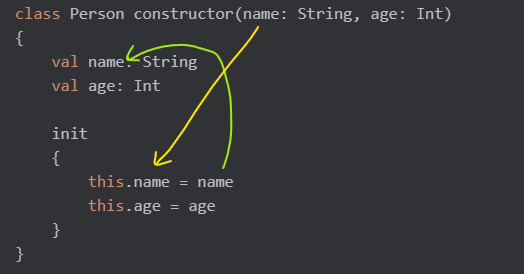

## Kotlin

코틀린은 자바의 단점을 보완하고자 나온 언어이다   
변수보단 상수를 쓰는게 실수나 버그를 줄일 수 있다

### Java와 차이점

- Null
    - java : null을 허용한다
    - kotlin
        - null을 허용하지 않는다 -> NullPointException 방지
        - list도 수정 불가
        - nullable type : null이 될 수 있는 타입을 명시적으로 표시 (타입 뒤에 물음표 붙임)

- 문자열 처리
    - java : + 연산 기호 사용
    - kotlin : $로 연결 가능
       ```kotlin
       fun main(){
         var name = "한석봉"
         val fullName = "홍$name"
         println(fullName) // -> 홍한석봉
       }
       ```
- 확장함수 지원 여부
    - kotlin : 기존 클래스에 새로운 메서드 추가하는 것처럼 사용
       ```kotlin
       // 형태 : fun 클래스명.함수명
      
      //String 확장함수
      fun String.addExclamation(): String {
      return this + "!"             //this는 확장 대상 클래스의 인스턴스
      }
  
      fun main() {
      val text = "Hello"
      println(text.addExclamation())  // 출력: Hello!
      }
  
       ```
### 변수
- var
  - 객체의 참조를 var로 선언하면, 객체 자체도 변경할 수 있고, 객체 속성도 변경할 수 있다.
    ```kotlin
    var person = Person("홍길동", 25)
    person = Person("다른 사람", 30)  // person 참조 자체를 변경 가능
    ```

- val
  - 객체의 참조를 **val**로 선언하면, 객체 참조 자체는 변경할 수 없지만, 객체 속성은 여전히 변경할 수 있다. (즉, 객체 내용은 변경 가능)
    ```kotlin
    val person = Person("홍길동", 25)
    // person = Person("다른 사람", 30)  // 오류 발생: person 참조는 변경 불가
    person.age = 26  // person 객체 내부 속성은 변경 가능
    ```

### 상수
|특징|companion object 사용|클래스 외부 선언|
|------|---|---|
|상수의 연관성|특정 클래스와 연관이 강함|특정 클래스와 연관이 없음|
|접근 방식|객체 지향적|절차 지향적|
|사용 범위|주로 클래스와 밀접하게 연결된 상수|파일 전체에서 사용 가능한 상수|
|코드의 의미 전달|클래스와 관련된 상수임을 명확히 전달|관련성을 암시하지 않음|

### 생성자
```kotlin
class 클래스 이름 constructor(생성자의 매개변수 선언) { }  //constructor는 생략 가능
```
* 생성자의 매개변수 
```kotlin
constructor(name: String, age: Int)
```
-> 객체가 생성될 때 외부에서 전달받는 임시 변수   
이 매개변수는 생성자와 초기화 블록(init)내부에서만 사용할 수 있다   
클래스 내에서 사용하려면 클래스의 프로퍼티로 저장해야 한다

* val로 선언된 프로퍼티
```kotlin
val name: String
val age: Int
```
-> 클래스 내부에서 접근하거나 사용할 수 있는 클래스의 속성   
클래스 전체에서 사용 가능   
생성자 매개변수로 전달받은 값을 저장하거나 init블록 또는 다른 초기화 방법으로 값 설정

* init 블록에서의 초기화
```kotlin
init
{
this.name = name
this.age = age
}
```
-> 생성자 매개변수로 전달받은 값을 클래스 프로퍼티에 할당하거나 초기화 로직 실행   
클래스의 모든 프로퍼티 및 생성자의 매개변수에 접근 가능   



객체 생성 시 생성자의 매개변수 name과 age에 전달된 값이 임시 변수로 생성된다   
init 블록에서 생성자 매개변수를 클래스의 프로퍼티 name과 age에 할당한다

- 위 코드의 간결화
```kotlin
class Person(val name: String, val age: Int)
// 곧바로 클래스의 프로퍼티로 선언하고 초기화
```
- 파라미터랑 속성 차이점   
    - 파라미터   
  함수 또는 생성자에 전달되는 입력값   
  var, val 붙이지 않고 선언한다   
  기본적으로 불변이다   
    - 속성   
  클래스의 상태를 나타내는 변수   
  클래스 내에서 선언되고 var, val 선택해서 사용 가능하다

### 함수
```kotlin
fun 함수명(파라미터1: 타입, 파라미터2: 타입, ··· ): 반환 타입 {
    return 값
}
```

### 상속
- 코틀린에서의 클래스와 메서드는 기본적으로 final이기 때문에 상속을 허용하려면 open 키워드를 앞에 붙여주어야 한다   
- open이 붙은 클래스는 상속이 가능하고, open이 붙은 메서드도 하위 클래스에서 override 가능하다
- super : super 키워드를 활용해 부모 클래스의 함수 기능을 사용한 후, 자식 클래스만의 추가 기능을 구현해주면 된다.

    ```kotlin
    open class Fruit{
        open fun introduce(){
            println("나는 과일이야!")
        }
    }
    
    class Apple : Fruit(){
        override fun introduce() {
            super.introduce()
            println("그 중에서 나는 사과야")
        }
    }
    
    fun main() {
        Apple().introduce()
    }
    ```
  
